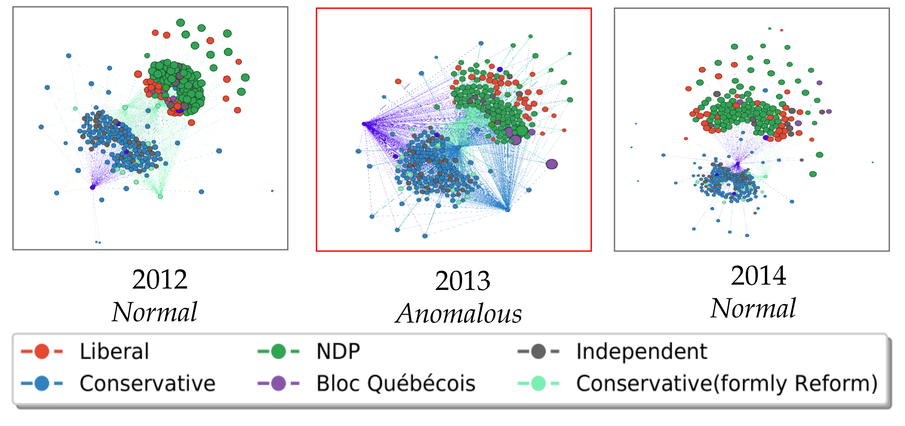

## LAD
Official python implementation of the paper: Laplacian Change Point Detection for Dynamic Graphs (KDD 2020)

<p>
  <a href="https://dl.acm.org/doi/10.1145/3394486.3403077">
    
  </a>

  <a href="https://arxiv.org/abs/2007.01229">
    
  </a>

   <a href="https://drive.google.com/file/d/1jBgNwCrKdOiuAwH28qlH6amtpYXzog9F/view?usp=sharing">
      
  </a>
  
  <a href="https://www.kdd.org/kdd2020/accepted-papers/view/laplacian-change-point-detection-for-dynamic-graphs">
    
  </a>
</p>




For more info on me and my work, please checkout my [website](https://www.cs.mcgill.ca/~shuang43/). 

If you have any questions, feel free to contact me at my email: shenyang.huang@mail.mcgill.ca

Many thanks to my amazing co-authors: Yasmeen Hitti, [Guillaume Rabusseau](https://www-labs.iro.umontreal.ca/~grabus/), [Reihaneh Rabbany](http://www.reirab.com/) 

## Follow-up Works

- Scale to Large Dynamic Graphs: [Fast and Attributed Change Detection on Dynamic Graphs](https://arxiv.org/abs/2305.08750) (PAKDD 2023), [github](https://github.com/shenyangHuang/SCPD)

- Extending to Multi-view Dynamic Graphs: [Laplacian Change Point Detection for Single and Multi-view Dynamic Graphs](https://arxiv.org/abs/2302.01204) (preprint), [github](https://github.com/shenyangHuang/multiLAD)


## Content:
all synthetic experiments and real world experiments from the paper can be reproduced here. 

## Datasets:
In datasets/, You can find edgeslists for both the synthetic and real world experiments we have. 

In datasets/canVote_processed, you can find our original Canadian Bill Voting network. 
if you use it, please cite this paper. 
 
## Usage:

1. first extract the edgelists in datasets/SBM_processed/hybrid, pure, resampled.zip

2. To reproduce synthetic experiments  (-n is the number of eigenvalues used) 

* python SBM_Command.py -f pure -n 499

substitute pure with hybrid or resampled for the corresponding settings

3. To reproduce real world experiments

* python Real_Command.py -d USLegis -n 6

* python Real_Command.py -d UCI -n 6

* python Real_Command.py -d canVote -n 338


## Library: 

1. python 3.8.1

2. scipy  1.4.1

3. scikit-learn 0.22.1

4. tensorly 0.4.5

5. networkx 2.4

6. matplotlib 1.3.1


## Citation:

If code or data from this repo is useful for your project, please consider citing our paper:
```
@inproceedings{huang2020laplacian,
  title={Laplacian Change Point Detection for Dynamic Graphs},
  author={Huang, Shenyang and Hitti, Yasmeen and Rabusseau, Guillaume and Rabbany, Reihaneh},
  booktitle={Proceedings of the 26th ACM SIGKDD International Conference on Knowledge Discovery \& Data Mining},
  pages={349--358},
  year={2020}
}
```
